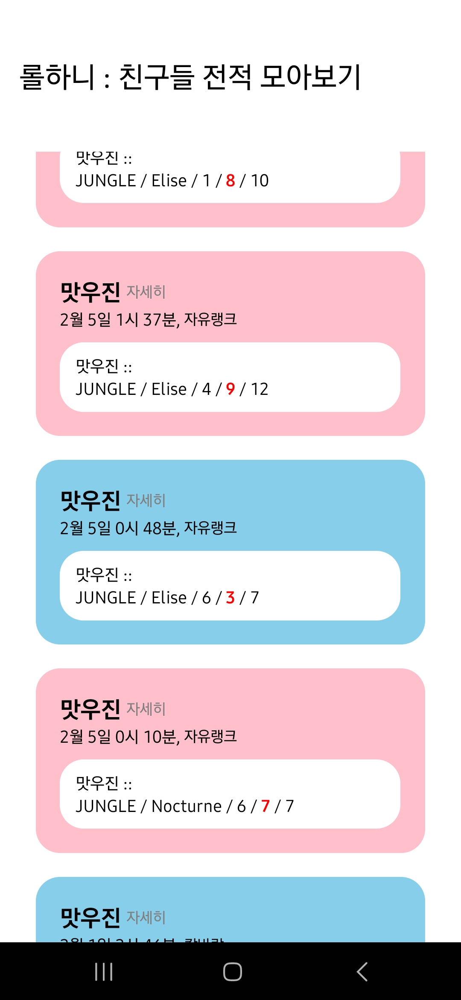
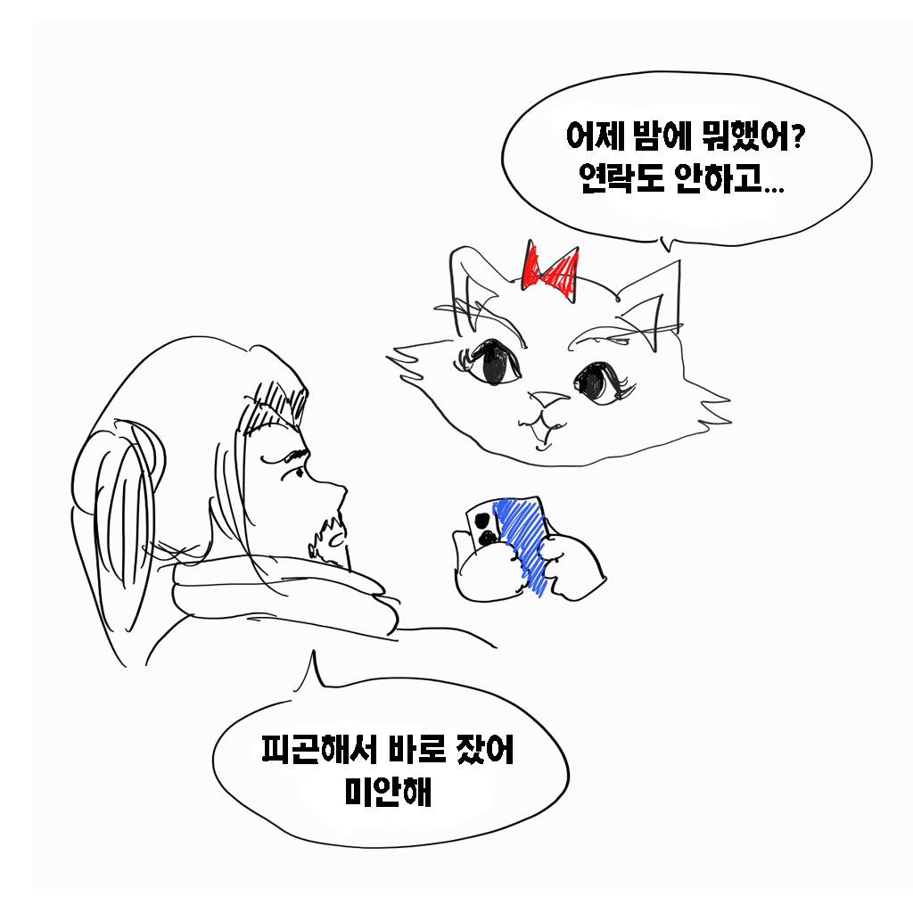

# 소개

위 사진은 리그오브레전드(롤) 전적을 조회하는 서비스입니다.

대부분 위와 같은 형태로, 유저의 닉네임을 검색하면 그 유저의 최근 게임 전적을 표시해줍니다.

다른 사람의 전적을 확인하고 싶으면 다시 검색을 해야한다는 번거로움이 있습니다.

**친구들의 전적을 한 번에 검색해서 한 화면에서 볼 수 없을까? 라는 생각에 <롤하니>를 만들기 시작했습니다.**

# <구글 플레이 스토어에서 다운로드>
https://play.google.com/store/apps/details?id=com.karinarang.numullbo

# 사용법

처음 앱을 실행시키면 왼쪽 화면과 같습니다.

팔로우 버튼을 눌러 유저를 검색하고 팔로우 리스트를 관리할 수 있습니다.

팔로우를 추가한 다음, 전적검색 버튼을 누르면 팔로우 목록에 있는 유저의 전적을 "한 번에" 조회할 수 있습니다.

오른쪽 화면처럼 피드형식으로 나열되며, 최근 게임 순으로 정렬되어 보여집니다.

해당 게임에서 승리했으면 파란색, 패배했으면 빨간색 배경으로 나타납니다.

클릭하게되면 게임을 플레이한 10명의 유저의 상세한 기록을 볼 수 있습니다.

# 홍보 이미지

